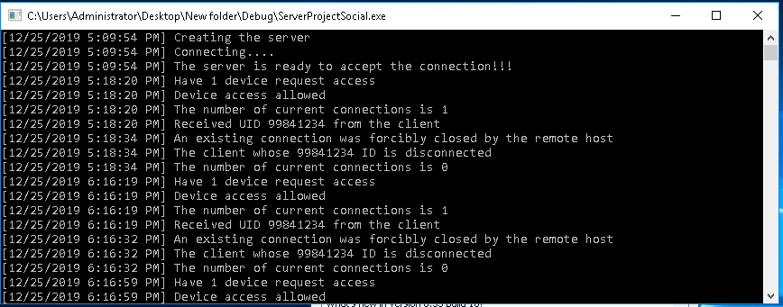
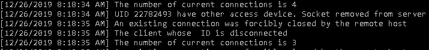
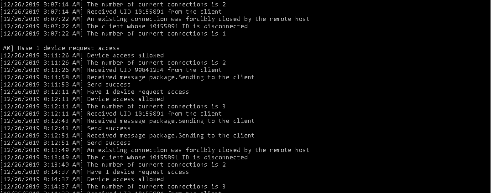
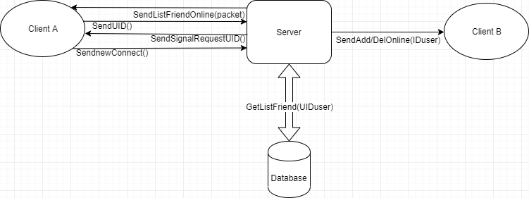
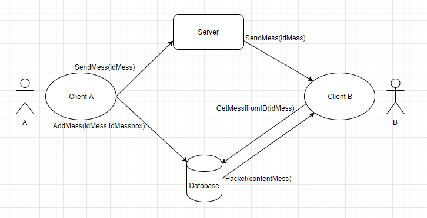
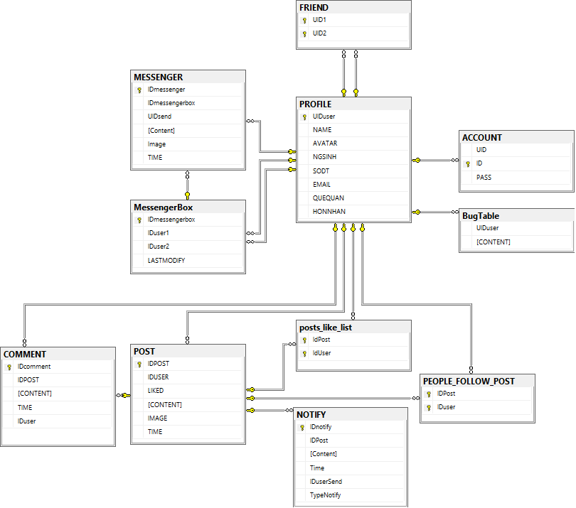

## Cấu trúc chương trình

# Client

- Sử dụng ADO.Net để giao tiếp với database
- Xử lý và gửi tín hiệu cho server
- Nhận và xử lý tín hiệu từ server
- Phân task cho từng phân vùng chạy

# Server

- Xử lý và gửi tín hiệu cho Client
- Nhận và xử lý tín hiệu từ Client
- Xử lý các hành vi: SendMess, UserOnline, SendNotify, HandleLogin
- Phân chia thread chạy và xử lý nhiều user cùng truy cập trong một lúc

# Handle Client-Server

Xử lý đăng nhập trên client

Xử Lý Gửi tin nhắn giữa các client

# Database

