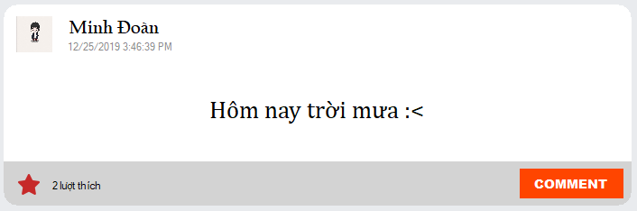
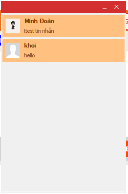
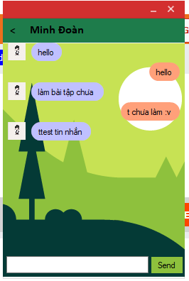
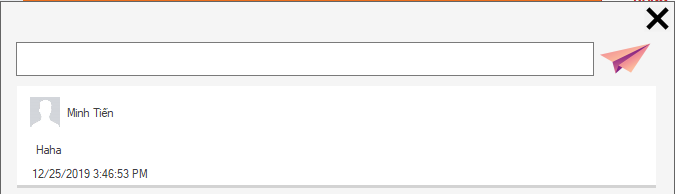
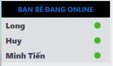
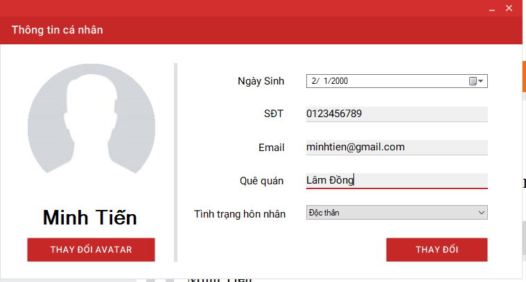
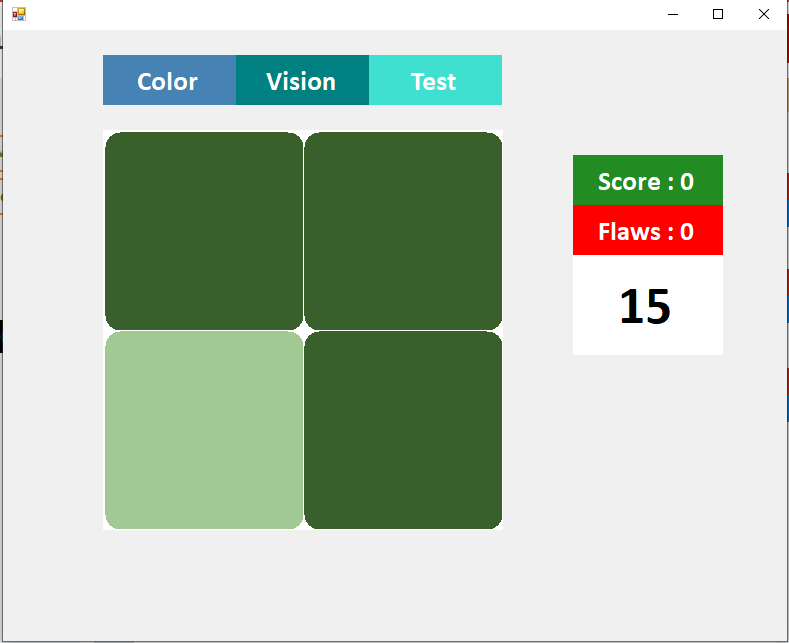

# Project SoucialHub
Ứng dụng mạng xã hội SocialHub được nhóm xây dựng bằng ngôn ngữ C# cho đồ án môn lập trình trực quan. SoucialHub được tích hợp rất nhiều tính năng giúp kết nối giữa mọi người.
- Giao diện đăng nhập

- Giao diện chính

## Features
- Tạo tài khoản, đăng nhập vào mạng xã hội bằng tài khoản của từng cá nhân
- Tìm kiếm realtime người dùng, kết bạn xem thông tin của người dùng khác
- Kết nối và tương tác giữa người dùng
  - Đăng trạng thái
  
  
  
  - Gửi tin nhắn
  
  
  
  
  - Like, comment bài viết
  

  
  
  

  - Hiển thị các người bạn đang online
    

  - Thông báo thông tin trực tiếp tới người dùng nếu đang online

  
- Cá nhân hoá thông tin của từng người sử dụng SoucialHub



- Chơi Game và chia sẻ kết quả nên newpost



## Getting started
- Đối với việc cài đặt để sử dụng SkyProcial 
  - Yêu cầu:
    - Máy tính đang sử dụng hệ điều hành windowns.
    - Đang sử dụng [.NET Framework 4.6](https://dotnet.microsoft.com/download/dotnet-framework) hoặc cao hơn.
    - Có kết nối mạng khi sử dụng
  - Cài đặt
    - Tải về file [SoucialHub.msi] trong thư mục [Installer](/Installer) hoặc ấn vào [link Google Drive](https://drive.google.com/drive/folders/1aBm2hEbWqQ2Dc8OSVsmZkvzZEWAcvyfP)
    - Mở file cài đặt mới tải về bằng quyền administrator
    - Làm theo hướng dẫn trong quá trình cài đặt. Nếu có lỗi hoặc cần hỗ trợ vui lòng gửi lại màn hình về [email](18521092@gm.uit.edu.vn) hoặc tìm kiếm user Admin  trong SoucialHub để được hỗ trợ.
  * Lưu ý: Phía trên chúng tôi sử dụng server demo nên việc truyền gửi thông tin có thể không thực sự được nhanh và ổn định.
- Đối với việc lấy code:
  - Chạy lệnh phía dưới trong máy tính của bạn đã cài git
  
   ```
   git clone https://github.com/minhdoan1510/Project-Social.git
   ```
   
    Hoặc chọn Download ZIP
   
  
## Author

- [Đoàn Công Minh](https://www.facebook.com/MinhDoan1510)  Email: 18521092@gm.uit.edu.vn
- [Bùi Minh Tiến](https://www.facebook.com/MinhTien1412)   Email: 18521481@gm.uit.edu.vn
